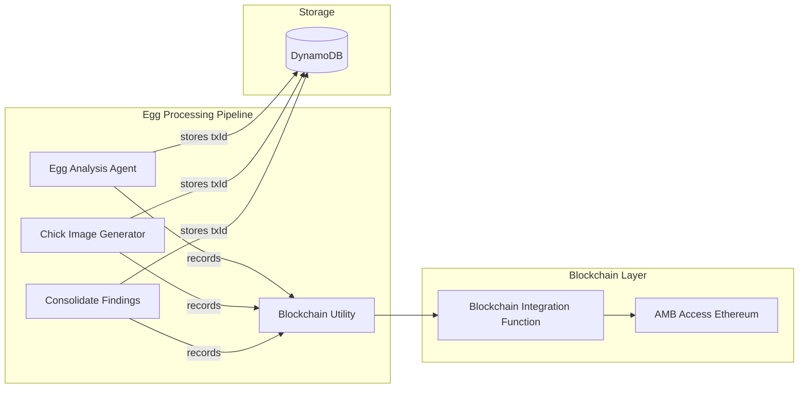

# Design Document: Blockchain Egg Tracking

## Overview

This feature integrates blockchain transaction recording into the egg processing pipeline. Each significant egg lifecycle event (analysis, image generation, consolidation) will be recorded on Ethereum via Amazon Managed Blockchain (AMB) Access, with transaction IDs stored in DynamoDB for audit trail purposes.

The implementation follows a simple pattern: create a shared utility that wraps the existing blockchain integration function, then call this utility from each processing Lambda at the appropriate point.

## Architecture



## Components and Interfaces

### 1. Blockchain Utility Module (`backend/functions/shared/blockchain-utils.mjs`)

A shared utility module that calls AMB Access for Ethereum directly to record events.

```javascript
// Interface - calls AMB Access directly via JSON-RPC
export async function recordToBlockchain(eggId, eventType, eventData) {
  // Generates transaction ID, creates SHA-512 hash of payload
  // Calls AMB Access eth_blockNumber to get current block
  // Returns: { transactionId, transactionHash, blockNumber } or null on failure
}
```

**Event Types:**
- `EGG_ANALYSIS_COMPLETE` - When egg analysis is saved
- `CHICK_IMAGE_GENERATED` - When chick image is created
- `CLUTCH_CONSOLIDATED` - When clutch findings are consolidated

### 2. Modified Lambda Functions

Each Lambda function will import the utility and call it at the appropriate point:

**Egg Analysis Agent:**
- Call `recordToBlockchain()` after saving analysis results
- Store transaction ID in egg record

**Chick Image Generator:**
- Call `recordToBlockchain()` after successful image upload
- Store transaction ID in egg record via UpdateCommand

**Consolidate Findings:**
- Call `recordToBlockchain()` after updating clutch metadata
- Store transaction ID in clutch METADATA record

## Data Models

### Egg Record (Updated)

```typescript
interface EggRecord {
  pk: string;              // "CLUTCH#{clutchId}"
  sk: string;              // "EGG#{eggId}"
  // ... existing fields ...

  // New blockchain fields
  analysisBlockchainTxId?: string;      // Transaction ID for analysis event
  analysisBlockchainHash?: string;      // Transaction hash for analysis
  imageBlockchainTxId?: string;         // Transaction ID for image generation
  imageBlockchainHash?: string;         // Transaction hash for image generation
}
```

### Clutch METADATA Record (Updated)

```typescript
interface ClutchMetadata {
  pk: string;              // "CLUTCH#{clutchId}"
  sk: string;              // "METADATA"
  // ... existing fields ...

  // New blockchain fields
  consolidationBlockchainTxId?: string;  // Transaction ID for consolidation
  consolidationBlockchainHash?: string;  // Transaction hash for consolidation
}
```

## Correctness Properties

*A property is a characteristic or behavior that should hold true across all valid executions of a system-essentially, a formal statement about what the system should do. Properties serve as the bridge between human-readable specifications and machine-verifiable correctness guarantees.*

Based on the prework analysis, the following properties can be consolidated:

### Property 1: Blockchain recording stores transaction ID

*For any* egg lifecycle event (analysis, image generation, or consolidation) that successfully records to blockchain, the corresponding DynamoDB record SHALL contain the transaction ID returned from the blockchain integration.

**Validates: Requirements 1.2, 2.2, 3.2**

### Property 2: Blockchain utility returns expected fields

*For any* successful call to the blockchain utility, the response SHALL contain transactionId, transactionHash, and blockNumber fields.

**Validates: Requirements 4.3**

### Property 3: Blockchain utility formats payload correctly

*For any* call to the blockchain utility with eggId, eventType, and eventData, the utility SHALL invoke the blockchain integration with a payload containing those exact values.

**Validates: Requirements 4.2**

## Error Handling

The blockchain recording is designed to be non-blocking:

1. **Try-Catch Wrapper**: All blockchain calls are wrapped in try-catch
2. **Graceful Degradation**: If blockchain recording fails, the main workflow continues
3. **Logging**: Failures are logged with error details for debugging
4. **No Retries**: Blockchain failures don't trigger SQS retries (to avoid duplicate processing)

```javascript
// Error handling pattern
try {
  const txResult = await recordToBlockchain(eggId, eventType, eventData);
  if (txResult) {
    // Store transaction ID in DynamoDB
  }
} catch (err) {
  console.error('Blockchain recording failed:', err);
  // Continue with main workflow
}
```

## Testing Strategy

### Unit Tests
- Test blockchain utility formats payloads correctly
- Test error handling doesn't throw exceptions

### Property-Based Tests
Using fast-check for JavaScript property-based testing:

1. **Property 1 Test**: Generate random egg IDs and event data, verify transaction ID storage
2. **Property 2 Test**: Generate random successful responses, verify field presence
3. **Property 3 Test**: Generate random inputs, verify payload structure

### Integration Tests (Manual)
- Deploy and verify end-to-end blockchain recording
- Check DynamoDB records contain transaction IDs after processing
