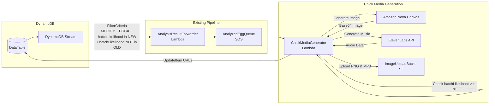

# Design Document: Chick Media Generation

## Overview

The Chick Media Generator extends the egg analysis pipeline to create both photorealistic images and custom music for predicted chicks using Amazon Nova Canvas and ElevenLabs. When an egg record is updated with analysis results showing high hatch likelihood (>= 70%), the system generates an image based on the predicted breed and appearance characteristics, creates custom music that reflects the chick's personality and breed traits, stores both assets in S3, and updates the DynamoDB record with their locations.

The architecture leverages the existing `AnalyzedEggQueue` and `AnalysisResultForwarder` infrastructure, adding a new Lambda function that:
- Filters for high-likelihood eggs
- Generates chick images via Nova Canvas
- Generates custom chick music via ElevenLabs
- Stores both media assets in S3
- Updates DynamoDB with media URLs

## Architecture



**Key Filter Logic:** The AnalysisResultForwarder filter must ensure hatchLikelihood exists in NewImage but NOT in OldImage. This prevents re-triggering when we update the record with chickImageUrl.

## Components and Interfaces

### 1. AnalyzedEggQueue (Existing)

The existing SQS queue that receives analyzed egg records from the AnalysisResultForwarder.

**Message Format:**
```json
{
  "pk": "BATCH#2024-01-15",
  "sk": "EGG#egg-001",
  "hatchLikelihood": 85,
  "predictedChickBreed": "Rhode Island Red",
  "chickenAppearance": {
    "plumageColor": "red-brown",
    "combType": "single",
    "bodyType": "large/heavy",
    "featherPattern": "solid",
    "legColor": "yellow"
  },
  ...
}
```

### 2. ChickMediaGenerator (Lambda)

Node.js Lambda function that processes analyzed eggs and generates both chick images and custom music.

**Interface:**
```typescript
interface EggRecord {
  pk: string;
  sk: string;  // "EGG#{eggId}"
  hatchLikelihood: number;
  predictedChickBreed: string;
  chickenAppearance: ChickenAppearance;
  // ... other egg fields
}

interface ChickenAppearance {
  plumageColor: string;
  combType: string;
  bodyType: string;
  featherPattern: string;
  legColor: string;
}

interface MediaGenerationResult {
  success: boolean;
  imageS3Key?: string;
  imageS3Uri?: string;
  musicS3Key?: string;
  musicS3Uri?: string;
  error?: string;
}
```

**Configuration:**
- Runtime: nodejs22.x
- Timeout: 120 seconds (both image and music generation can take time)
- Memory: 1024 MB (for media processing)
- Environment Variables: ELEVENLABS_API_KEY

### 3. Nova Canvas Integration

Uses Amazon Nova Canvas (amazon.nova-canvas-v1:0) for image generation.

**Prompt Construction:**
```
A photorealistic image of a cute baby chick, {predictedChickBreed} breed.
The chick has {plumageColor} downy feathers, a small {combType} comb beginning to form,
{bodyType} body proportions, {featherPattern} feather pattern emerging, and {legColor} legs.
The chick is standing on clean straw in a warm brooder with soft lighting.
Professional poultry photography style, high detail, adorable expression.
```

**API Request:**
```javascript
{
  modelId: 'amazon.nova-canvas-v1:0',
  contentType: 'application/json',
  accept: 'application/json',
  body: JSON.stringify({
    taskType: 'TEXT_IMAGE',
    textToImageParams: {
      text: prompt
    },
    imageGenerationConfig: {
      numberOfImages: 1,
      width: 1024,
      height: 1024,
      quality: 'standard'
    }
  })
}
```

### 4. ElevenLabs Music Integration

Uses ElevenLabs API for generating custom chick music based on breed characteristics.

**Music Description Construction:**
```
A cheerful and playful melody for a baby {predictedChickBreed} chick.
The music should reflect the {bodyType} nature and {plumageColor} personality of this breed.
{featherPattern} rhythmic patterns with a {combType} melodic structure.
Warm, nurturing tones suitable for a farm setting with gentle {legColor} undertones.
```

**API Request:**
```javascript
{
  text: musicDescription,
  duration_seconds: 15,
  prompt_influence: 0.3,
  style: "cheerful farm music"
}
```

### 5. S3 Storage

Uses the existing ImageUploadBucket for storing both generated chick images and music.

**Key Formats:** 
- Images: `chicks/{pk}/{eggId}.png`
- Music: `chicks/{pk}/{eggId}.mp3`
- Example: `chicks/BATCH#2024-01-15/egg-001.png` and `chicks/BATCH#2024-01-15/egg-001.mp3`

**S3 URI Formats:** 
- Images: `s3://{bucket}/chicks/{pk}/{eggId}.png`
- Music: `s3://{bucket}/chicks/{pk}/{eggId}.mp3`

### 6. DynamoDB Update

Updates the original egg record with both image and music information.

**Update Expression:**
```javascript
{
  TableName: TABLE_NAME,
  Key: { pk, sk },
  UpdateExpression: 'SET chickImageUrl = :imageUrl, chickMusicUrl = :musicUrl, mediaGeneratedAt = :ts',
  ExpressionAttributeValues: {
    ':imageUrl': imageS3Uri,
    ':musicUrl': musicS3Uri,
    ':ts': new Date().toISOString()
  }
}
```

## Data Models

### Input (Analyzed Egg Record)
```json
{
  "pk": "BATCH#2024-01-15",
  "sk": "EGG#egg-001",
  "color": "brown",
  "shape": "oval",
  "size": "large",
  "hatchLikelihood": 85,
  "predictedChickBreed": "Rhode Island Red",
  "chickenAppearance": {
    "plumageColor": "red-brown",
    "combType": "single",
    "bodyType": "large/heavy",
    "featherPattern": "solid",
    "legColor": "yellow"
  },
  "analysisTimestamp": "2024-01-15T10:30:00Z"
}
```

### Output (Updated Egg Record)
```json
{
  "pk": "BATCH#2024-01-15",
  "sk": "EGG#egg-001",
  "color": "brown",
  "shape": "oval",
  "size": "large",
  "hatchLikelihood": 85,
  "predictedChickBreed": "Rhode Island Red",
  "chickenAppearance": {
    "plumageColor": "red-brown",
    "combType": "single",
    "bodyType": "large/heavy",
    "featherPattern": "solid",
    "legColor": "yellow"
  },
  "analysisTimestamp": "2024-01-15T10:30:00Z",
  "chickImageUrl": "s3://hackathon-image-uploads-123456789/chicks/BATCH#2024-01-15/egg-001.png",
  "chickMusicUrl": "s3://hackathon-image-uploads-123456789/chicks/BATCH#2024-01-15/egg-001.mp3",
  "mediaGeneratedAt": "2024-01-15T10:31:00Z"
}
```

## Correctness Properties

*A property is a characteristic or behavior that should hold true across all valid executions of a system-essentially, a formal statement about what the system should do. Properties serve as the bridge between human-readable specifications and machine-verifiable correctness guarantees.*

### Property 1: Hatch Likelihood Threshold Behavior

*For any* egg record, the shouldGenerateMedia function SHALL return true if and only if hatchLikelihood >= 70.

**Validates: Requirements 1.1, 1.2**

### Property 2: Appearance Extraction

*For any* valid egg record containing chickenAppearance and predictedChickBreed, the extractAppearance function SHALL return an object with all five appearance fields (plumageColor, combType, bodyType, featherPattern, legColor) and the breed.

**Validates: Requirements 1.3**

### Property 3: Image Prompt Contains All Characteristics

*For any* chicken appearance with predictedChickBreed, plumageColor, combType, bodyType, featherPattern, and legColor, the constructed image prompt SHALL contain all six values as substrings.

**Validates: Requirements 2.1**

### Property 4: Music Description Contains All Characteristics

*For any* chicken appearance with predictedChickBreed and chickenAppearance characteristics, the constructed music description SHALL contain the breed name and all appearance characteristics as substrings.

**Validates: Requirements 3.1**

### Property 5: Music Request Parameters

*For any* music generation request, the API call SHALL specify 15-second duration and include breed-appropriate style parameters.

**Validates: Requirements 3.2**

### Property 6: S3 Key Construction for Images

*For any* pk and eggId values, the constructed image S3 key SHALL match the format "chicks/{pk}/{eggId}.png".

**Validates: Requirements 4.1**

### Property 7: S3 Key Construction for Music

*For any* pk and eggId values, the constructed music S3 key SHALL match the format "chicks/{pk}/{eggId}.mp3".

**Validates: Requirements 4.2**

### Property 8: Content Type Assignment

*For any* file upload, the ContentType SHALL be "image/png" for .png files and "audio/mpeg" for .mp3 files.

**Validates: Requirements 4.3**

### Property 9: S3 URI Construction

*For any* bucket name and S3 key, the constructed S3 URI SHALL match the format "s3://{bucket}/{key}".

**Validates: Requirements 4.4**

### Property 10: Record Update Preserves Fields and Adds Media Data

*For any* egg record, image S3 URI, and music S3 URI, the update operation SHALL preserve all existing fields and add chickImageUrl, chickMusicUrl, and mediaGeneratedAt as a valid ISO timestamp.

**Validates: Requirements 5.1, 5.2**

## Error Handling

| Error Scenario | Handling Strategy |
|----------------|-------------------|
| hatchLikelihood < 70 | Skip processing, log info, delete message |
| Missing chickenAppearance | Use default appearance values, log warning |
| Nova Canvas invocation failure | Log error, message returns to queue for retry |
| Invalid Nova Canvas response | Log error, skip image generation, continue with music |
| ElevenLabs API failure | Log error, skip music generation, continue with image |
| Invalid ElevenLabs response | Log error, skip music generation |
| S3 upload failure (image) | Log error, message returns to queue for retry |
| S3 upload failure (music) | Log error, continue with image-only update |
| DynamoDB update failure | Log error, media exists in S3 but record not updated |

## Testing Strategy

### Property-Based Testing

The system will use **fast-check** as the property-based testing library for Node.js.

**Configuration:**
- Minimum 100 iterations per property test
- Each test tagged with format: `**Feature: chick-image-generation, Property {number}: {property_text}**`

### Generators

```typescript
import * as fc from 'fast-check';

// Hatch likelihood generator
const hatchLikelihoodArb = fc.integer({ min: 0, max: 100 });

// Chicken appearance generator
const chickenAppearanceArb = fc.record({
  plumageColor: fc.oneof(
    fc.constant('white'), fc.constant('red-brown'), fc.constant('black'),
    fc.constant('golden'), fc.constant('buff'), fc.constant('barred')
  ),
  combType: fc.oneof(
    fc.constant('single'), fc.constant('rose'), fc.constant('pea'), fc.constant('walnut')
  ),
  bodyType: fc.oneof(
    fc.constant('large/heavy'), fc.constant('medium'), fc.constant('small/bantam'), fc.constant('slender')
  ),
  featherPattern: fc.oneof(
    fc.constant('solid'), fc.constant('laced'), fc.constant('barred'), fc.constant('speckled')
  ),
  legColor: fc.oneof(
    fc.constant('yellow'), fc.constant('slate'), fc.constant('white'), fc.constant('black')
  )
});

// Breed generator
const breedArb = fc.oneof(
  fc.constant('Rhode Island Red'), fc.constant('Leghorn'), fc.constant('Plymouth Rock'),
  fc.constant('Ameraucana'), fc.constant('Orpington'), fc.constant('Marans')
);

// Egg record generator
const eggRecordArb = fc.record({
  pk: fc.string({ minLength: 1 }).map(s => `BATCH#${s}`),
  sk: fc.string({ minLength: 1 }).map(s => `EGG#${s}`),
  hatchLikelihood: hatchLikelihoodArb,
  predictedChickBreed: breedArb,
  chickenAppearance: chickenAppearanceArb
});

// S3 bucket name generator
const bucketNameArb = fc.string({ minLength: 3, maxLength: 63 })
  .filter(s => /^[a-z0-9][a-z0-9.-]*[a-z0-9]$/.test(s));
```

### Unit Tests

- Verify shouldGenerateImage returns correct boolean for boundary values (69, 70, 71)
- Verify prompt construction with edge case appearance values
- Verify S3 key encoding handles special characters in pk/eggId
