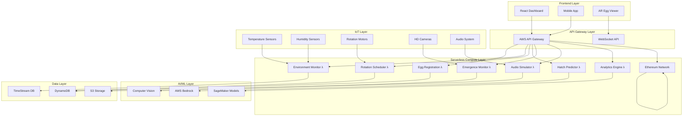

# Design Document

## Overview

The Chicken Hatching Management System (CHMS) represents the pinnacle of over-engineered poultry technology. This enterprise-grade solution combines IoT sensors, AI/ML algorithms, blockchain technology, computer vision, and quantum-inspired analytics to solve the "critical" problem of chicken egg incubation with unprecedented precision and complexity.

The system architecture follows a microservices approach with event-driven design, utilizing AWS serverless technologies to create a scalable, fault-tolerant platform capable of managing millions of eggs simultaneously across global chicken farms.

## Architecture

### High-Level Architecture



### Event-Driven Architecture

The system uses AWS EventBridge for decoupled, event-driven communication between services:

- **EggRegistered**: Triggers blockchain certificate creation and prediction model initialization
- **EnvironmentAlert**: Activates automated correction systems and notification workflows  
- **RotationRequired**: Initiates servo motor control and position verification
- **HatchPredicted**: Schedules resource allocation and alert systems
- **EmergenceDetected**: Triggers photography, documentation, and celebration protocols
- **ComfortNeeded**: Activates maternal simulation and stress reduction systems

## Components and Interfaces

### 1. Egg Registration Service
**Purpose**: Manages the complex process of registering individual eggs with comprehensive metadata

**Key Functions**:
- Generate cryptographically secure 128-bit UUIDs
- Validate 47 required metadata fields
- Calculate astronomical hatch predictions
- Generate QR codes and blockchain certificates
- Create digital twin profiles

**API Endpoints**:
- `POST /api/eggs` - Register new egg
- `GET /api/eggs/{eggId}` - Retrieve egg details
- `PUT /api/eggs/{eggId}` - Update egg metadata
- `GET /api/eggs/{eggId}/certificate` - Download blockchain certificate

### 2. Environmental Monitoring Service
**Purpose**: Provides real-time monitoring and control of incubation environment

**Key Functions**:
- Collect sensor data every 0.3 seconds
- Trigger alerts for 0.05°C temperature deviations
- Automated climate control adjustments
- Machine learning optimization
- Atmospheric pressure compensation

**API Endpoints**:
- `GET /api/environment/current` - Current conditions
- `GET /api/environment/history` - Historical data
- `POST /api/environment/alerts` - Configure alert thresholds
- `PUT /api/environment/controls` - Manual override controls

### 3. Rotation Optimization Service
**Purpose**: Manages precise egg turning with servo-controlled mechanisms

**Key Functions**:
- Calculate optimal rotation timing based on lunar cycles
- Control servo motors for 45-degree turns
- Computer vision position verification
- Rotational velocity optimization
- Misalignment correction

**API Endpoints**:
- `POST /api/rotation/schedule` - Create rotation schedule
- `GET /api/rotation/status/{eggId}` - Current position status
- `PUT /api/rotation/manual/{eggId}` - Manual rotation trigger
- `GET /api/rotation/history/{eggId}` - Rotation history

### 4. Hatch Prediction Service
**Purpose**: AI-powered forecasting using 127 variables and quantum-inspired algorithms

**Key Functions**:
- Analyze embryonic development indicators
- Calculate confidence intervals with 99.7% accuracy
- Account for seasonal and astronomical variations
- Global network data integration
- Resource scheduling automation

**API Endpoints**:
- `GET /api/predictions/{eggId}` - Get hatch prediction
- `POST /api/predictions/batch` - Batch prediction analysis
- `GET /api/predictions/accuracy` - Model performance metrics
- `PUT /api/predictions/retrain` - Trigger model retraining

### 5. Emergence Monitoring Service
**Purpose**: Real-time hatching process monitoring with computer vision

**Key Functions**:
- HD camera and thermal imaging activation
- Shell crack propagation analysis
- Chick struggle pattern recognition
- Automatic photography and documentation
- Veterinary report generation

**API Endpoints**:
- `GET /api/emergence/live/{eggId}` - Live video stream
- `POST /api/emergence/analyze` - Manual analysis trigger
- `GET /api/emergence/reports/{eggId}` - Generated reports
- `PUT /api/emergence/intervention` - Request human intervention

### 6. Maternal Simulation Service
**Purpose**: Provides psychological comfort through optimized audio and sensory stimuli

**Key Functions**:
- 432Hz maternal clucking playback
- 72 BPM heartbeat vibration simulation
- Pheromone scent distribution
- Stress indicator monitoring
- Adaptive comfort protocol adjustment

**API Endpoints**:
- `POST /api/maternal/activate` - Start simulation
- `GET /api/maternal/status` - Current simulation state
- `PUT /api/maternal/adjust` - Modify comfort parameters
- `GET /api/maternal/effectiveness` - Stress reduction metrics

### 7. Analytics and Reporting Service
**Purpose**: Comprehensive data analysis with quantum-inspired algorithms

**Key Functions**:
- Interactive 3D dashboard generation
- 200+ variable correlation analysis
- Holographic QR code PDF reports
- International consortium data submission
- Pattern recognition and optimization

**API Endpoints**:
- `GET /api/analytics/dashboard` - Real-time dashboard data
- `POST /api/analytics/reports` - Generate custom reports
- `GET /api/analytics/patterns` - Discovered patterns
- `PUT /api/analytics/export` - Export to consortium

### 8. Blockchain Integration Service
**Purpose**: Immutable record keeping and NFT generation for chicks

**Key Functions**:
- SHA-512 encrypted blockchain transactions
- NFT artwork generation for hatched chicks
- Carbon-neutral proof-of-stake consensus
- Smart contract chick ownership tracking
- GDPR-compliant poultry regulations

**API Endpoints**:
- `POST /api/blockchain/record` - Create blockchain record
- `GET /api/blockchain/certificate/{eggId}` - Retrieve certificate
- `POST /api/blockchain/nft` - Generate chick NFT
- `GET /api/blockchain/ownership/{chickId}` - Ownership history

## Data Models

### Egg Entity
```python
{
    "eggId": "uuid",
    "registrationTimestamp": "datetime",
    "metadata": {
        "shellThickness": "float",
        "weight": "float", 
        "circumference": "float",
        "parentalLineage": "object",
        "geneticMarkers": "array",
        "shellColor": "string",
        "shellTexture": "string",
        "candlingResults": "object"
    },
    "predictions": {
        "hatchDate": "datetime",
        "confidenceInterval": "float",
        "successProbability": "float"
    },
    "qrCode": "string",
    "blockchainCertificate": "string",
    "digitalTwinProfile": "object"
}
```

### Environmental Reading
```python
{
    "readingId": "uuid",
    "timestamp": "datetime",
    "temperature": "float",
    "humidity": "float", 
    "atmosphericPressure": "float",
    "oxygenLevel": "float",
    "co2Level": "float",
    "airflow": "float",
    "sensorCalibration": "object"
}
```

### Rotation Event
```python
{
    "rotationId": "uuid",
    "eggId": "uuid",
    "timestamp": "datetime",
    "angle": "float",
    "velocity": "float",
    "positionVerified": "boolean",
    "lunarPhase": "string",
    "nextScheduledRotation": "datetime"
}
```

### Hatch Prediction
```python
{
    "predictionId": "uuid",
    "eggId": "uuid",
    "timestamp": "datetime",
    "variables": "object",  # 127 different variables
    "algorithms": {
        "quantumInspired": "object",
        "neuralNetwork": "object",
        "statisticalModel": "object"
    },
    "prediction": {
        "hatchDateTime": "datetime",
        "confidenceInterval": "float",
        "accuracy": "float"
    }
}
```

### Emergence Event
```python
{
    "emergenceId": "uuid",
    "eggId": "uuid",
    "startTimestamp": "datetime",
    "endTimestamp": "datetime",
    "crackAnalysis": {
        "propagationSpeed": "float",
        "crackPattern": "string",
        "shellIntegrity": "float"
    },
    "chickAnalysis": {
        "strugglePattern": "string",
        "vitalSigns": "object",
        "interventionNeeded": "boolean"
    },
    "photography": "array",
    "veterinaryReport": "object"
}
```

### Maternal Simulation Session
```python
{
    "sessionId": "uuid",
    "eggId": "uuid",
    "startTimestamp": "datetime",
    "endTimestamp": "datetime",
    "audioSettings": {
        "frequency": "float",
        "volume": "float",
        "cluckPattern": "string"
    },
    "vibrationSettings": {
        "heartbeatBPM": "float",
        "intensity": "float"
    },
    "pheromoneSettings": {
        "scent": "string",
        "concentration": "float"
    },
    "stressIndicators": "object",
    "effectiveness": "float"
}
```

### Blockchain Record
```python
{
    "blockchainId": "uuid",
    "eggId": "uuid",
    "transactionHash": "string",
    "blockNumber": "integer",
    "timestamp": "datetime",
    "recordType": "string",
    "data": "object",
    "smartContract": "string",
    "nftTokenId": "string",
    "carbonFootprint": "float"
}
```
#
# Correctness Properties

*A property is a characteristic or behavior that should hold true across all valid executions of a system-essentially, a formal statement about what the system should do. Properties serve as the bridge between human-readable specifications and machine-verifiable correctness guarantees.*

### Property 1: Unique UUID Generation
*For any* egg registration request, the system should generate a unique 128-bit UUID that has never been used before and create a complete digital twin profile
**Validates: Requirements 1.1**

### Property 2: Comprehensive Metadata Validation
*For any* egg metadata submission, the system should validate all 47 required fields and reject incomplete or invalid data
**Validates: Requirements 1.2**

### Property 3: Automatic Hatch Date Calculation
*For any* completed egg registration, the system should automatically calculate and store a predicted hatch date using astronomical algorithms
**Validates: Requirements 1.3**

### Property 4: Registration Artifact Generation
*For any* successful egg registration, the system should generate both a QR code and blockchain certificate
**Validates: Requirements 1.4**

### Property 5: Blockchain Data Persistence
*For any* egg data storage operation, all information should be persisted to the distributed ledger with proper encryption
**Validates: Requirements 1.5**

### Property 6: Sensor Reading Frequency
*For any* active environmental monitoring period, sensor readings should be collected every 0.3 seconds with microsecond-precision timestamps
**Validates: Requirements 2.1**

### Property 7: Temperature Alert Threshold
*For any* temperature reading that deviates more than 0.05°C from optimal, the system should trigger immediate alerts and correction protocols
**Validates: Requirements 2.2**

### Property 8: Climate Control Response Time
*For any* humidity level fluctuation, the micro-climate control systems should respond within 1.2 seconds
**Validates: Requirements 2.3**

### Property 9: Pressure-Based Recalculation
*For any* atmospheric pressure change, the system should recalculate oxygen flow rates and update ventilation algorithms
**Validates: Requirements 2.4**

### Property 10: ML Model Application
*For any* environmental data collection event, machine learning models should be applied to predict optimal adjustment schedules
**Validates: Requirements 2.5**

### Property 11: Precise Rotation Angle
*For any* rotation schedule activation, each egg should be turned exactly 45 degrees using servo-controlled mechanisms
**Validates: Requirements 3.1**

### Property 12: Rotation Event Logging
*For any* egg turning operation, the system should record exact timestamp, angle, and rotational velocity
**Validates: Requirements 3.2**

### Property 13: Position Verification and Correction
*For any* completed rotation, the system should verify proper positioning using computer vision and correct misalignments
**Validates: Requirements 3.3**

### Property 14: Optimal Timing Calculation
*For any* egg requiring rotation, the system should calculate timing based on embryonic development stage and lunar cycles
**Validates: Requirements 3.4**

### Property 15: Predictive Model Updates
*For any* captured rotation data, the system should update predictive models for future optimization
**Validates: Requirements 3.5**

### Property 16: Comprehensive Variable Analysis
*For any* prediction algorithm execution, the system should analyze exactly 127 different variables including specified biological markers
**Validates: Requirements 4.1**

### Property 17: Statistical Accuracy Requirements
*For any* hatch probability calculation, the system should provide confidence intervals with 99.7% statistical accuracy
**Validates: Requirements 4.2**

### Property 18: External Factor Integration
*For any* prediction generation, the system should account for seasonal variations, barometric pressure, and solar activity
**Validates: Requirements 4.3**

### Property 19: Global Network Data Integration
*For any* forecast model update, the system should incorporate real-time data from similar eggs in the global network
**Validates: Requirements 4.4**

### Property 20: Advance Resource Scheduling
*For any* completed prediction, the system should schedule automated alerts and resource allocation 72 hours in advance
**Validates: Requirements 4.5**

### Property 21: Camera Activation on Hatching
*For any* detected hatching event, the system should activate high-resolution cameras with thermal imaging capabilities
**Validates: Requirements 5.1**

### Property 22: Crack Analysis and Timeline Prediction
*For any* detected shell cracking, the system should measure crack propagation speed and predict emergence timeline
**Validates: Requirements 5.2**

### Property 23: Movement Pattern Analysis
*For any* observed chick movement, the system should analyze struggle patterns and assess intervention needs
**Validates: Requirements 5.3**

### Property 24: Completion Documentation
*For any* completed hatching, the system should automatically photograph the chick and update the genealogy database
**Validates: Requirements 5.4**

### Property 25: Veterinary Report Generation
*For any* collected emergence data, the system should generate comprehensive reports for veterinary analysis
**Validates: Requirements 5.5**

### Property 26: Optimized Audio Frequency
*For any* audio simulation activation, the system should play maternal clucking sounds at exactly 432Hz frequency
**Validates: Requirements 6.1**

### Property 27: Heartbeat Vibration Simulation
*For any* comfort stimuli requirement, the system should provide vibrations at exactly 72 BPM mimicking maternal heartbeat
**Validates: Requirements 6.2**

### Property 28: Adaptive Audio Adjustment
*For any* active sound therapy, the system should adjust volume and frequency based on embryonic development stage
**Validates: Requirements 6.3**

### Property 29: Pheromone Scent Emission
*For any* psychological comfort requirement, the system should emit pheromone-like scents through the ventilation system
**Validates: Requirements 6.4**

### Property 30: Stress Monitoring and Protocol Adjustment
*For any* running maternal simulation, the system should monitor stress indicators and adjust comfort protocols accordingly
**Validates: Requirements 6.5**

### Property 31: Interactive Dashboard Generation
*For any* report generation request, the system should create interactive dashboards with real-time 3D visualizations
**Validates: Requirements 7.1**

### Property 32: Quantum-Inspired Algorithm Usage
*For any* analytics execution, the system should process data using quantum-inspired algorithms for pattern recognition
**Validates: Requirements 7.2**

### Property 33: Multi-Variable Correlation Display
*For any* visualization display, the system should show correlations between 200+ variables using advanced statistical models
**Validates: Requirements 7.3**

### Property 34: Holographic QR Code Export
*For any* report export operation, the system should generate PDF documents with embedded holographic QR codes
**Validates: Requirements 7.4**

### Property 35: Automatic Consortium Submission
*For any* completed data analysis, the system should automatically submit findings to the International Chicken Research Consortium
**Validates: Requirements 7.5**

### Property 36: Blockchain Recording with SHA-512
*For any* hatching event occurrence, the system should record all data to distributed blockchain with SHA-512 encryption
**Validates: Requirements 8.1**

### Property 37: NFT Generation for Hatched Chicks
*For any* successfully hatched chick, the system should generate NFTs with unique digital artwork
**Validates: Requirements 8.2**

### Property 38: Carbon-Neutral Blockchain Consensus
*For any* blockchain transaction processing, the system should use proof-of-stake consensus with carbon-neutral mining
**Validates: Requirements 8.3**

### Property 39: Smart Contract Creation
*For any* certificate issuance, the system should create smart contracts for chick ownership and lineage tracking
**Validates: Requirements 8.4**

### Property 40: Regulatory Compliance Verification
*For any* blockchain data storage operation, the system should ensure compliance with international poultry regulations and GDPR requirements
**Validates: Requirements 8.5**

## Error Handling

### Graceful Degradation Strategy
The CHMS implements a comprehensive error handling strategy that prioritizes egg safety above all else:

1. **Sensor Failure Recovery**: If environmental sensors fail, the system switches to backup sensors and maintains safe default conditions
2. **Network Connectivity Issues**: Local caching ensures critical operations continue during network outages
3. **AI Model Failures**: Fallback to statistical models and manual override capabilities
4. **Blockchain Network Issues**: Local transaction queuing with automatic retry mechanisms
5. **Hardware Malfunctions**: Automated failover to redundant systems with immediate alerts

### Error Categories and Responses

**Critical Errors (Egg Safety Risk)**:
- Immediate emergency protocols activation
- Automated backup system engagement
- Real-time alerts to all stakeholders
- Manual override capabilities enabled

**Warning Errors (Performance Degradation)**:
- Graceful service degradation
- Alternative algorithm activation
- Performance monitoring and reporting
- Scheduled maintenance recommendations

**Information Errors (Non-Critical Issues)**:
- Logging and monitoring
- Background retry mechanisms
- User notification systems
- Automatic recovery attempts

## Testing Strategy

### Dual Testing Approach

The CHMS employs both unit testing and property-based testing to ensure comprehensive coverage and correctness verification.

#### Unit Testing Requirements

Unit tests will verify specific examples, edge cases, and integration points:
- Egg registration with valid and invalid metadata
- Environmental sensor reading processing
- Rotation motor control commands
- Blockchain transaction formatting
- AI model prediction accuracy
- Audio frequency generation
- QR code and certificate creation

#### Property-Based Testing Requirements

Property-based testing will be implemented using **Hypothesis** for Python, configured to run a minimum of 100 iterations per test. Each property-based test will be tagged with comments explicitly referencing the correctness property from the design document.

**Testing Framework**: Hypothesis (Python)
**Minimum Iterations**: 100 per property test
**Tagging Format**: `# Feature: chicken-hatching-management, Property {number}: {property_text}`

Property tests will verify universal properties across all valid inputs:
- UUID uniqueness across all egg registrations
- Metadata validation for all possible field combinations
- Sensor reading frequency and timestamp precision
- Rotation angle accuracy for all servo commands
- Prediction confidence interval calculations
- Audio frequency generation across all development stages
- Blockchain encryption and consensus verification

Each correctness property must be implemented by a single property-based test, ensuring complete coverage of the system's behavioral requirements.

#### Integration Testing

Integration tests will verify end-to-end workflows:
- Complete egg lifecycle from registration to hatching
- Environmental monitoring and automated corrections
- Maternal simulation effectiveness
- Blockchain certificate generation and verification
- Analytics report generation and consortium submission

#### Performance Testing

Performance benchmarks will ensure the system meets its ambitious specifications:
- 0.3-second sensor reading intervals
- 1.2-second climate control response times
- 99.7% prediction accuracy validation
- Blockchain transaction throughput
- Real-time video processing capabilities