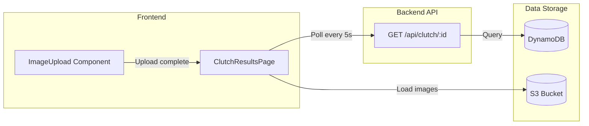

# Design Document: Clutch Results Display

## Overview

The Clutch Results Display is a React page component that shows the analysis results for a clutch of eggs. After an image is uploaded and processed, users navigate to this page to see:
- Total eggs detected and how many will hatch
- Individual chick images as they are generated
- A full portrait of all viable chicks

The component uses simple polling (every 5 seconds) to fetch updated data from the existing get-clutch API endpoint. No websockets or complex real-time infrastructure required.

## Architecture



## Components and Interfaces

### 1. ClutchResultsPage Component

Main page component that displays clutch analysis results.

**Route:** `/clutch/[id]`

**Props:**
```typescript
interface ClutchResultsPageProps {
  clutchId: string;
}
```

**State:**
```typescript
interface ClutchResultsState {
  clutch: ClutchData | null;
  loading: boolean;
  error: string | null;
  isPolling: boolean;
}

interface ClutchData {
  id: string;
  uploadTimestamp: string;
  imageKey: string;
  eggCount: number;
  viabilityPercentage: number | null;
  eggs: EggData[];
}

interface EggData {
  id: string;
  hatchLikelihood: number;
  possibleHenBreeds: string[];
  predictedChickBreed: string;
  breedConfidence: string;
  chickenAppearance: ChickenAppearance;
  chickImageUrl?: string;
  notes: string;
}

interface ChickenAppearance {
  plumageColor: string;
  combType: string;
  bodyType: string;
  featherPattern: string;
  legColor: string;
}
```

### 2. Processing Status Logic

```typescript
type ProcessingStatus = 'analyzing' | 'generating_images' | 'complete';

function getProcessingStatus(clutch: ClutchData): ProcessingStatus {
  if (clutch.eggs.length === 0) {
    return 'analyzing';
  }
  
  const viableEggs = clutch.eggs.filter(e => e.hatchLikelihood >= 70);
  const eggsWithImages = viableEggs.filter(e => e.chickImageUrl);
  
  if (eggsWithImages.length < viableEggs.length) {
    return 'generating_images';
  }
  
  return 'complete';
}
```

### 3. Viability Calculation

```typescript
function getViableEggCount(eggs: EggData[]): number {
  return eggs.filter(egg => egg.hatchLikelihood >= 70).length;
}

function getViableEggs(eggs: EggData[]): EggData[] {
  return eggs.filter(egg => egg.hatchLikelihood >= 70);
}
```

### 4. Progress Calculation

```typescript
function getProgress(clutch: ClutchData): number {
  if (clutch.eggs.length === 0) return 0;
  
  const viableEggs = getViableEggs(clutch.eggs);
  if (viableEggs.length === 0) return 100; // No images needed
  
  const eggsWithImages = viableEggs.filter(e => e.chickImageUrl).length;
  return Math.round((eggsWithImages / viableEggs.length) * 100);
}
```

## Data Models

### API Response (GET /api/clutch/:id)

The existing get-clutch endpoint returns:

```json
{
  "id": "550e8400-e29b-41d4-a716-446655440000",
  "uploadTimestamp": "2024-01-15T10:30:00Z",
  "imageKey": "uploads/clutch-image-123.jpg",
  "eggCount": 5,
  "viabilityPercentage": 72.5,
  "eggs": [
    {
      "id": "660e8400-e29b-41d4-a716-446655440001",
      "hatchLikelihood": 85,
      "possibleHenBreeds": ["Rhode Island Red", "Plymouth Rock"],
      "predictedChickBreed": "Rhode Island Red",
      "breedConfidence": "high",
      "chickenAppearance": {
        "plumageColor": "red-brown",
        "combType": "single",
        "bodyType": "large/heavy",
        "featherPattern": "solid",
        "legColor": "yellow"
      },
      "chickImageUrl": "s3://bucket/chicks/CLUTCH#.../egg1.png",
      "notes": "Healthy egg with good shell quality"
    }
  ]
}
```

## Correctness Properties

*A property is a characteristic or behavior that should hold true across all valid executions of a system-essentially, a formal statement about what the system should do. Properties serve as the bridge between human-readable specifications and machine-verifiable correctness guarantees.*

### Property 1: Viable Egg Count Calculation
*For any* array of eggs with hatchLikelihood values, the viable egg count SHALL equal the number of eggs where hatchLikelihood >= 70.
**Validates: Requirements 1.4**

### Property 2: Chick Image Display for Viable Eggs
*For any* egg with hatchLikelihood >= 70 and a chickImageUrl, the component SHALL render an image element with that URL.
**Validates: Requirements 2.1**

### Property 3: Placeholder for Pending Images
*For any* egg with hatchLikelihood >= 70 and no chickImageUrl, the component SHALL render a placeholder element.
**Validates: Requirements 2.2**

### Property 4: Full Portrait Visibility
*For any* clutch where all viable eggs have chickImageUrl populated, the Full Portrait section SHALL be visible.
**Validates: Requirements 3.1**

### Property 5: Processing Status Transitions
*For any* clutch data, the processing status SHALL be 'analyzing' when eggs.length === 0, 'generating_images' when some viable eggs lack images, and 'complete' when all viable eggs have images.
**Validates: Requirements 5.1, 5.2, 5.3**

### Property 6: Progress Percentage Calculation
*For any* clutch with viable eggs, the progress percentage SHALL equal (eggs with images / total viable eggs) * 100.
**Validates: Requirements 5.4**

### Property 7: Polling Stops When Complete
*For any* clutch where processing status is 'complete', the polling interval SHALL be cleared.
**Validates: Requirements 4.3**

## Error Handling

| Error Scenario | Handling Strategy |
|----------------|-------------------|
| Clutch not found (404) | Display "Clutch not found" message with link to upload |
| API request fails | Show error toast, continue polling |
| Invalid clutch ID | Redirect to home page |
| Image load fails | Show broken image placeholder |

## Testing Strategy

### Property-Based Testing

The system will use **fast-check** as the property-based testing library.

**Configuration:**
- Minimum 100 iterations per property test
- Each test tagged with format: `**Feature: clutch-results-display, Property {number}: {property_text}**`

**Generators:**
```typescript
import * as fc from 'fast-check';

// Egg data generator
const eggDataArb = fc.record({
  id: fc.uuid(),
  hatchLikelihood: fc.integer({ min: 0, max: 100 }),
  possibleHenBreeds: fc.array(fc.constantFrom('Rhode Island Red', 'Leghorn', 'Plymouth Rock'), { minLength: 1, maxLength: 3 }),
  predictedChickBreed: fc.constantFrom('Rhode Island Red', 'Leghorn', 'Plymouth Rock'),
  breedConfidence: fc.constantFrom('high', 'medium', 'low'),
  chickenAppearance: fc.record({
    plumageColor: fc.constantFrom('red-brown', 'white', 'black'),
    combType: fc.constantFrom('single', 'rose', 'pea'),
    bodyType: fc.constantFrom('large/heavy', 'medium', 'small/bantam'),
    featherPattern: fc.constantFrom('solid', 'laced', 'barred'),
    legColor: fc.constantFrom('yellow', 'slate', 'white')
  }),
  chickImageUrl: fc.option(fc.webUrl(), { nil: undefined }),
  notes: fc.string({ maxLength: 200 })
});

// Clutch data generator
const clutchDataArb = fc.record({
  id: fc.uuid(),
  uploadTimestamp: fc.date().map(d => d.toISOString()),
  imageKey: fc.string().map(s => `uploads/${s}.jpg`),
  eggCount: fc.integer({ min: 0, max: 20 }),
  viabilityPercentage: fc.option(fc.float({ min: 0, max: 100 }), { nil: null }),
  eggs: fc.array(eggDataArb, { maxLength: 20 })
});
```

### Unit Tests

- Test getViableEggCount with various egg arrays
- Test getProcessingStatus state transitions
- Test getProgress calculation
- Test component rendering with different clutch states

