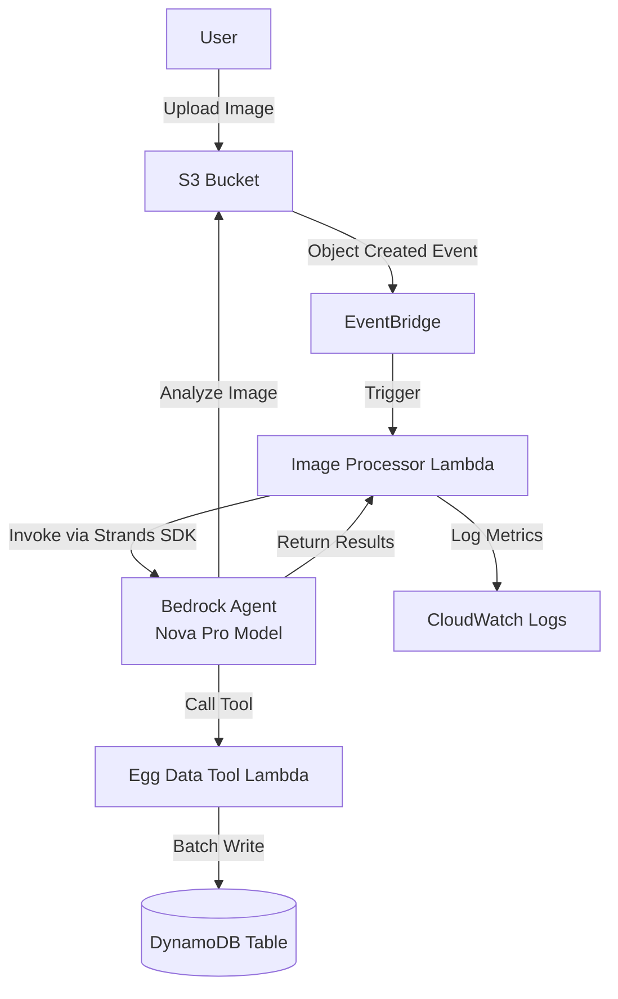

# Design Document: Egg Quality Analysis System

## Overview

The Egg Quality Analysis System is a serverless, event-driven application that automatically processes egg images uploaded to S3, performs AI-powered quality assessment using Amazon Bedrock agents with the Nova Pro model, and stores structured quality data in DynamoDB. The system leverages AWS EventBridge for event routing, Lambda for compute, and the Strands SDK for Bedrock agent orchestration.

### Key Components

- **S3 Bucket**: Storage for uploaded egg images
- **EventBridge Rule**: Event-driven trigger for S3 object creation
- **Image Processor Lambda**: Orchestrates the analysis workflow using Strands SDK
- **Bedrock Agent**: AI agent configured with Nova Pro model for image analysis
- **Egg Data Tool**: Lambda function tool that stores egg quality records
- **DynamoDB Table**: Persistent storage for egg quality assessments

## Architecture

### System Architecture Diagram



### Event Flow

1. User uploads egg image to S3 bucket
2. S3 emits object creation event to EventBridge
3. EventBridge rule matches event and triggers Image Processor Lambda
4. Image Processor extracts S3 location and invokes Bedrock Agent via Strands SDK
5. Bedrock Agent retrieves image from S3 and analyzes with Nova Pro model
6. Agent identifies individual eggs and assesses quality dimensions
7. Agent invokes Egg Data Tool with array of egg records
8. Egg Data Tool validates and batch writes to DynamoDB
9. Tool returns success/failure status to Agent
10. Agent returns complete results to Image Processor
11. Image Processor logs metrics and completes

## Components and Interfaces

### 1. S3 Bucket Configuration

**Purpose**: Store uploaded egg images and serve as event source

**Configuration**:
- Bucket name: `${StackName}-egg-images-${AWS::AccountId}`
- EventBridge notifications enabled
- Versioning: Disabled (latest version only)
- Lifecycle policy: Optional retention rules

**Supported Image Formats**: JPEG, PNG, TIFF

### 2. EventBridge Rule

**Purpose**: Route S3 object creation events to Image Processor Lambda

**Event Pattern**:
```json
{
  "source": ["aws.s3"],
  "detail-type": ["Object Created"],
  "detail": {
    "bucket": {
      "name": ["${EggImagesBucket}"]
    }
  }
}
```

**Target**: Image Processor Lambda function

### 3. Image Processor Lambda Function

**Purpose**: Orchestrate egg analysis workflow using Bedrock Agent

**Runtime**: Node.js 20.x
**Architecture**: ARM64
**Memory**: 512 MB
**Timeout**: 300 seconds (5 minutes)

**Environment Variables**:
- `BEDROCK_AGENT_ID`: The Bedrock agent identifier
- `BEDROCK_AGENT_ALIAS_ID`: The agent alias identifier
- `TABLE_NAME`: DynamoDB table name for egg records
- `AWS_REGION`: AWS region for Bedrock service

**Dependencies**:
- `@aws-sdk/client-bedrock-agent-runtime`: For Bedrock agent invocation
- `@strandsinc/strands-sdk`: Strands SDK for agent orchestration

**Handler Interface**:
```typescript
interface S3EventBridgeEvent {
  version: string;
  id: string;
  'detail-type': 'Object Created';
  source: 'aws.s3';
  detail: {
    bucket: { name: string };
    object: { key: string; size: number };
  };
}

interface EggAnalysisResult {
  imageKey: string;
  eggsAnalyzed: number;
  recordsStored: number;
  processingTimeMs: number;
  status: 'success' | 'partial' | 'failed';
  errors?: string[];
}

export async function handler(event: S3EventBridgeEvent): Promise<EggAnalysisResult>
```

**Processing Logic**:
1. Extract bucket name and object key from EventBridge event
2. Validate image file extension (jpg, jpeg, png, tiff)
3. Initialize Strands SDK client with Bedrock agent configuration
4. Invoke agent with S3 image location and analysis prompt
5. Handle agent response and extract egg data
6. Log processing metrics (duration, egg count, success/failure)
7. Return result summary

**Error Handling**:
- Retry agent invocation up to 3 times with exponential backoff (1s, 2s, 4s)
- Log all errors with full context (event details, agent response)
- Throw exception for critical failures to trigger Lambda retry mechanism

### 4. Bedrock Agent Configuration

**Purpose**: Analyze egg images and coordinate tool invocation

**Model**: Amazon Nova Pro (multimodal)
**Agent Name**: `egg-quality-analyzer`

**Agent Instructions**:
```
You are an expert egg quality analyst. When given an image of eggs:

1. Identify each individual egg in the image
2. For each egg, assess the following quality dimensions:
   - Color: Describe the shell color (white, brown, cream, speckled, etc.)
   - Shape: Classify as (round, oval, elongated, irregular)
   - Size: Categorize as (small, medium, large, extra-large, jumbo)
   - Shell Texture: Describe surface texture (smooth, rough, pitted, bumpy)
   - Shell Integrity: Assess structural soundness (intact, hairline-crack, cracked, broken)
   - Hardness: Indicate shell strength (hard, normal, soft, thin)
   - Spot Markings: Identify spots (none, light, moderate, heavy)
   - Bloom Condition: Assess protective coating (excellent, good, fair, poor, removed)
   - Cleanliness: Rate cleanliness (clean, slightly-dirty, dirty, very-dirty)
   - Visible Defects: List any defects (none, stains, blood-spots, meat-spots, deformities)
   - Overall Grade: Assign grade (AA, A, B, C, reject)

3. Use the create_egg_data tool to store all egg assessments
4. Return a summary of the analysis

Be thorough and consistent in your assessments.
```

**Tools**: 
- `create_egg_data`: Stores egg quality records in DynamoDB

### 5. Egg Data Tool (Lambda Function)

**Purpose**: Validate and store egg quality records in DynamoDB

**Runtime**: Node.js 20.x
**Architecture**: ARM64
**Memory**: 256 MB
**Timeout**: 60 seconds

**Tool Schema**:
```json
{
  "toolSpec": {
    "name": "create_egg_data",
    "description": "Stores egg quality assessment data for multiple eggs in DynamoDB",
    "inputSchema": {
      "json": {
        "type": "object",
        "properties": {
          "eggs": {
            "type": "array",
            "description": "Array of egg quality assessment records",
            "items": {
              "type": "object",
              "properties": {
                "color": { "type": "string", "description": "Shell color" },
                "shape": { "type": "string", "description": "Egg shape classification" },
                "size": { "type": "string", "description": "Size category" },
                "shellTexture": { "type": "string", "description": "Surface texture" },
                "shellIntegrity": { "type": "string", "description": "Structural soundness" },
                "hardness": { "type": "string", "description": "Shell strength" },
                "spotMarkings": { "type": "string", "description": "Spot presence and severity" },
                "bloomCondition": { "type": "string", "description": "Protective coating status" },
                "cleanliness": { "type": "string", "description": "Cleanliness level" },
                "visibleDefects": { "type": "string", "description": "Any visible defects" },
                "overallGrade": { "type": "string", "description": "Quality grade" }
              },
              "required": ["color", "shape", "size", "shellTexture", "shellIntegrity", 
                          "hardness", "spotMarkings", "bloomCondition", "cleanliness", 
                          "visibleDefects", "overallGrade"]
            }
          },
          "imageKey": {
            "type": "string",
            "description": "S3 object key of the source image"
          }
        },
        "required": ["eggs", "imageKey"]
      }
    }
  }
}
```

**Handler Interface**:
```typescript
interface EggRecord {
  color: string;
  shape: string;
  size: string;
  shellTexture: string;
  shellIntegrity: string;
  hardness: string;
  spotMarkings: string;
  bloomCondition: string;
  cleanliness: string;
  visibleDefects: string;
  overallGrade: string;
}

interface ToolInput {
  eggs: EggRecord[];
  imageKey: string;
}

interface ToolResponse {
  success: boolean;
  recordsStored: number;
  recordsFailed: number;
  errors?: string[];
}

export async function handler(event: ToolInput): Promise<ToolResponse>
```

**Processing Logic**:
1. Validate input structure and required fields
2. Generate unique ID for each egg record (UUID)
3. Enrich records with metadata (timestamp, image S3 location)
4. Use DynamoDB batch write (max 25 items per batch)
5. Retry failed items up to 3 times
6. Return success/failure summary

### 6. DynamoDB Table Schema

**Purpose**: Store egg quality assessment records

**Table Name**: `${StackName}-egg-quality-data`
**Billing Mode**: PAY_PER_REQUEST

**Primary Key**:
- Partition Key: `pk` (String) - Format: `IMAGE#{imageKey}`
- Sort Key: `sk` (String) - Format: `EGG#{eggId}`

**Attributes**:
- `eggId` (String): Unique identifier (UUID)
- `imageKey` (String): S3 object key of source image
- `analyzedAt` (String): ISO 8601 timestamp
- `color` (String): Shell color
- `shape` (String): Shape classification
- `size` (String): Size category
- `shellTexture` (String): Texture description
- `shellIntegrity` (String): Integrity status
- `hardness` (String): Hardness indication
- `spotMarkings` (String): Spot markings
- `bloomCondition` (String): Bloom condition
- `cleanliness` (String): Cleanliness level
- `visibleDefects` (String): Defects list
- `overallGrade` (String): Quality grade

**Access Patterns**:
1. Query all eggs from a specific image: `pk = IMAGE#{imageKey}`
2. Get specific egg record: `pk = IMAGE#{imageKey} AND sk = EGG#{eggId}`

**Global Secondary Indexes**: None (simple access patterns)

## Data Models

### EggRecord Data Model

```typescript
interface EggRecord {
  // Primary identifiers
  eggId: string;              // UUID
  imageKey: string;           // S3 object key
  analyzedAt: string;         // ISO 8601 timestamp
  
  // Quality dimensions
  color: string;              // white | brown | cream | speckled | other
  shape: string;              // round | oval | elongated | irregular
  size: string;               // small | medium | large | extra-large | jumbo
  shellTexture: string;       // smooth | rough | pitted | bumpy
  shellIntegrity: string;     // intact | hairline-crack | cracked | broken
  hardness: string;           // hard | normal | soft | thin
  spotMarkings: string;       // none | light | moderate | heavy
  bloomCondition: string;     // excellent | good | fair | poor | removed
  cleanliness: string;        // clean | slightly-dirty | dirty | very-dirty
  visibleDefects: string;     // none | stains | blood-spots | meat-spots | deformities
  overallGrade: string;       // AA | A | B | C | reject
  
  // DynamoDB keys
  pk: string;                 // IMAGE#{imageKey}
  sk: string;                 // EGG#{eggId}
}
```

### Agent Invocation Request

```typescript
interface AgentInvocationRequest {
  agentId: string;
  agentAliasId: string;
  sessionId: string;          // Generated UUID for each invocation
  inputText: string;          // Analysis prompt with S3 location
}
```

### Agent Response

```typescript
interface AgentResponse {
  completion: string;         // Agent's text response
  trace: {
    orchestrationTrace: {
      observation: {
        actionGroupInvocationOutput?: {
          text: string;       // Tool response
        };
      };
    };
  };
}
```

## Co
rrectness Properties

*A property is a characteristic or behavior that should hold true across all valid executions of a system—essentially, a formal statement about what the system should do. Properties serve as the bridge between human-readable specifications and machine-verifiable correctness guarantees.*

### Property 1: Event payload parsing extracts S3 location

*For any* valid S3 EventBridge event payload, the ImageProcessor should correctly extract both the bucket name and object key.

**Validates: Requirements 1.3**

### Property 2: Image format validation accepts supported formats

*For any* file with extensions jpg, jpeg, png, or tiff (case-insensitive), the ImageProcessor should accept the file for processing.

**Validates: Requirements 1.4**

### Property 3: Unsupported formats terminate gracefully

*For any* file with an extension other than jpg, jpeg, png, or tiff, the ImageProcessor should terminate without invoking the Bedrock agent and return a graceful error.

**Validates: Requirements 1.5**

### Property 4: Agent invocation includes S3 location

*For any* S3 bucket and object key, when the ImageProcessor invokes the Bedrock agent, the invocation payload should contain the complete S3 location.

**Validates: Requirements 2.2**

### Property 5: Retry logic executes with exponential backoff

*For any* agent invocation that fails, the ImageProcessor should retry up to 3 times with exponentially increasing delays (1s, 2s, 4s).

**Validates: Requirements 2.4**

### Property 6: Agent response contains all quality dimensions

*For any* egg assessment returned by the Bedrock agent, the response should include all 11 required quality dimensions: color, shape, size, shellTexture, shellIntegrity, hardness, spotMarkings, bloomCondition, cleanliness, visibleDefects, and overallGrade.

**Validates: Requirements 4.1, 4.2, 4.3, 4.4, 4.5, 4.6, 4.7, 4.8, 4.9, 4.10, 4.11**

### Property 7: Tool accepts array input

*For any* valid array of EggRecord objects, the EggDataTool should accept the input without schema validation errors.

**Validates: Requirements 5.2**

### Property 8: Tool validates required fields

*For any* EggRecord with one or more missing required fields, the EggDataTool should reject the record and return a validation error.

**Validates: Requirements 5.3**

### Property 9: Validation errors identify invalid records

*For any* batch of EggRecords containing invalid records, the EggDataTool error response should identify which specific records failed validation.

**Validates: Requirements 5.4**

### Property 10: Data persistence round-trip

*For any* valid EggRecord, storing it in DynamoDB and then retrieving it should return an equivalent record with all 11 quality dimensions, the unique ID, image key, and timestamp preserved.

**Validates: Requirements 6.1, 6.2, 6.3, 6.4, 6.5, 6.6, 6.7, 6.8, 6.9, 6.10, 6.11, 6.12, 6.13, 6.14**

### Property 11: Unique ID generation

*For any* batch of multiple EggRecords stored in a single operation, each record should receive a unique identifier that differs from all other records in the batch.

**Validates: Requirements 6.12**

### Property 12: Batch retry logic

*For any* batch write operation where some items fail, the EggDataTool should retry only the failed items up to 3 times.

**Validates: Requirements 7.2**

### Property 13: Partial failure handling

*For any* batch containing both valid and invalid records, the EggDataTool should successfully store all valid records and report failures only for invalid records.

**Validates: Requirements 7.3**

### Property 14: Success response accuracy

*For any* successful batch write operation, the EggDataTool response should include a count that exactly matches the number of records stored.

**Validates: Requirements 7.4**

### Property 15: Partial success response accuracy

*For any* batch write operation with partial success, the EggDataTool response should include accurate counts for both successfully stored and failed records, where the sum equals the total input count.

**Validates: Requirements 7.5**

## Error Handling

### Image Processor Lambda Errors

**Invalid File Format**:
- Detection: Check file extension against allowed list
- Response: Log warning with file details, return graceful error
- Status: Non-retryable error

**Agent Invocation Failure**:
- Detection: Bedrock SDK throws exception
- Response: Retry with exponential backoff (3 attempts)
- Logging: Log each attempt with error details
- Final failure: Throw exception to trigger Lambda retry

**Agent Timeout**:
- Detection: Invocation exceeds configured timeout
- Response: Log timeout error, throw exception
- Status: Retryable error (Lambda will retry)

**Missing Environment Variables**:
- Detection: Check required env vars at function initialization
- Response: Throw exception immediately
- Status: Configuration error (requires fix and redeploy)

### Egg Data Tool Errors

**Schema Validation Failure**:
- Detection: Missing required fields in EggRecord
- Response: Return error with list of invalid records
- Status: Non-retryable (client error)

**DynamoDB Write Failure**:
- Detection: BatchWriteItem returns unprocessed items
- Response: Retry failed items up to 3 times
- Logging: Log each retry attempt
- Final failure: Return partial success with failed item details

**DynamoDB Throttling**:
- Detection: ProvisionedThroughputExceededException
- Response: Exponential backoff retry (handled by AWS SDK)
- Status: Retryable error

**Invalid Input Type**:
- Detection: Input is not an array or contains non-object items
- Response: Return error describing expected format
- Status: Non-retryable (client error)

### Error Response Format

All errors should follow a consistent structure:

```typescript
interface ErrorResponse {
  success: false;
  error: {
    code: string;           // ERROR_CODE in UPPER_SNAKE_CASE
    message: string;        // Human-readable description
    details?: any;          // Additional context
    retryable: boolean;     // Whether retry might succeed
  };
}
```

**Error Codes**:
- `INVALID_FILE_FORMAT`: Unsupported image format
- `AGENT_INVOCATION_FAILED`: Bedrock agent invocation error
- `AGENT_TIMEOUT`: Agent exceeded timeout
- `VALIDATION_FAILED`: Input validation error
- `DYNAMODB_WRITE_FAILED`: Database write error
- `PARTIAL_SUCCESS`: Some records succeeded, some failed
- `CONFIGURATION_ERROR`: Missing or invalid configuration

## Testing Strategy

### Unit Testing

The system will use **Vitest** as the testing framework for unit tests, providing fast execution and excellent TypeScript support.

**Image Processor Lambda Tests**:
- Test event payload parsing with various EventBridge event structures
- Test file extension validation with supported and unsupported formats
- Test agent invocation parameter construction
- Test retry logic with mocked failures
- Test error handling for various failure scenarios
- Test logging output format

**Egg Data Tool Tests**:
- Test input validation with valid and invalid records
- Test batch write logic with mocked DynamoDB client
- Test retry logic for failed items
- Test response format for success, failure, and partial success
- Test unique ID generation
- Test record enrichment (timestamp, metadata)

**Test Utilities**:
- Mock EventBridge event generator
- Mock Bedrock agent response generator
- Mock DynamoDB client with configurable success/failure
- Test data builders for EggRecord objects

### Property-Based Testing

The system will use **fast-check** as the property-based testing library for Node.js/TypeScript.

**Configuration**:
- Each property test should run a minimum of 100 iterations
- Use seed-based randomization for reproducibility
- Configure appropriate shrinking for counterexample minimization

**Tagging Convention**:
Each property-based test must include a comment tag in this exact format:
```typescript
// **Feature: egg-quality-analysis, Property {number}: {property description}**
```

**Property Test Implementation Requirements**:
- Each correctness property from the design document must be implemented as a single property-based test
- Tests should be placed in files co-located with the code they test (e.g., `imageProcessor.test.ts`)
- Each test should reference the specific property number from this design document

**Property Tests to Implement**:

1. **Property 1**: Event payload parsing - Generate random valid EventBridge events, verify extraction
2. **Property 2**: Format validation - Generate random file names with supported extensions, verify acceptance
3. **Property 3**: Unsupported formats - Generate random unsupported extensions, verify graceful termination
4. **Property 4**: S3 location in payload - Generate random S3 locations, verify inclusion in agent invocation
5. **Property 5**: Retry backoff - Simulate failures, verify retry count and timing
6. **Property 6**: Quality dimensions - Generate random agent responses, verify all 11 fields present
7. **Property 7**: Array input - Generate random arrays of valid records, verify acceptance
8. **Property 8**: Field validation - Generate records with random missing fields, verify rejection
9. **Property 9**: Error identification - Generate batches with random invalid records, verify error details
10. **Property 10**: Round-trip - Generate random EggRecords, verify store-retrieve equivalence
11. **Property 11**: Unique IDs - Generate random batch sizes, verify all IDs are unique
12. **Property 12**: Batch retry - Simulate random failures, verify retry behavior
13. **Property 13**: Partial failure - Generate mixed valid/invalid batches, verify partial success
14. **Property 14**: Success count - Generate random valid batches, verify count accuracy
15. **Property 15**: Partial success count - Generate mixed batches, verify count accuracy

**Generators**:
- `arbEventBridgeEvent()`: Generates valid S3 EventBridge events
- `arbImageFileName()`: Generates file names with various extensions
- `arbS3Location()`: Generates bucket names and object keys
- `arbEggRecord()`: Generates valid EggRecord objects
- `arbInvalidEggRecord()`: Generates records with missing fields
- `arbEggRecordBatch()`: Generates arrays of egg records

### Integration Testing

**End-to-End Flow Test**:
- Upload test image to S3
- Verify EventBridge triggers Lambda
- Verify Lambda invokes Bedrock agent
- Verify agent calls tool
- Verify data appears in DynamoDB
- Verify all fields are correctly stored

**AWS Service Integration**:
- Test actual Bedrock agent invocation with test images
- Test DynamoDB batch write with real table
- Test EventBridge rule triggering

**Test Environment**:
- Use separate AWS account or isolated resources
- Use test-specific S3 bucket and DynamoDB table
- Clean up resources after tests

### Testing Best Practices

- **Implementation-first development**: Implement features before writing tests
- **Complementary testing**: Use both unit tests (specific examples) and property tests (universal properties)
- **Mock external services**: Mock Bedrock and DynamoDB in unit tests, use real services in integration tests
- **Test data management**: Use builders and generators for consistent test data
- **Error scenario coverage**: Test both happy paths and error conditions
- **Performance testing**: Verify Lambda execution time stays within limits

## Security Considerations

### IAM Permissions

**Image Processor Lambda Role**:
```yaml
Policies:
  - S3ReadPolicy:
      BucketName: !Ref EggImagesBucket
  - Statement:
      - Effect: Allow
        Action:
          - bedrock:InvokeAgent
        Resource: !Sub 'arn:aws:bedrock:${AWS::Region}:${AWS::AccountId}:agent/*'
```

**Egg Data Tool Lambda Role**:
```yaml
Policies:
  - DynamoDBCrudPolicy:
      TableName: !Ref EggQualityTable
```

**EventBridge Rule Role**:
```yaml
Policies:
  - Statement:
      - Effect: Allow
        Action:
          - lambda:InvokeFunction
        Resource: !GetAtt ImageProcessorFunction.Arn
```

### Data Security

- **Encryption at rest**: Enable DynamoDB encryption using AWS managed keys
- **Encryption in transit**: All AWS service communications use TLS
- **S3 bucket security**: 
  - Block public access
  - Enable versioning for audit trail
  - Configure bucket policy to restrict access
- **Secrets management**: Store sensitive configuration in AWS Systems Manager Parameter Store
- **Least privilege**: Each component has only the permissions it needs

### Input Validation

- Validate S3 event structure before processing
- Validate image file extensions
- Validate tool input schema
- Sanitize all user-provided data before logging
- Limit image file size (max 10 MB)

## Deployment

### Infrastructure as Code

The system will be deployed using AWS SAM (Serverless Application Model) with the following resources:

**SAM Template Structure**:
```yaml
Resources:
  # S3 Bucket for egg images
  EggImagesBucket:
    Type: AWS::S3::Bucket
    Properties:
      NotificationConfiguration:
        EventBridgeConfiguration:
          EventBridgeEnabled: true
  
  # DynamoDB table for egg quality data
  EggQualityTable:
    Type: AWS::DynamoDB::Table
    Properties:
      BillingMode: PAY_PER_REQUEST
      AttributeDefinitions:
        - AttributeName: pk
          AttributeType: S
        - AttributeName: sk
          AttributeType: S
      KeySchema:
        - AttributeName: pk
          KeyType: HASH
        - AttributeName: sk
          KeyType: RANGE
  
  # Image Processor Lambda
  ImageProcessorFunction:
    Type: AWS::Serverless::Function
    Properties:
      Runtime: nodejs20.x
      Handler: index.handler
      CodeUri: functions/imageProcessor/
      Timeout: 300
      MemorySize: 512
      Environment:
        Variables:
          BEDROCK_AGENT_ID: !Ref BedrockAgentId
          BEDROCK_AGENT_ALIAS_ID: !Ref BedrockAgentAliasId
          TABLE_NAME: !Ref EggQualityTable
  
  # EventBridge Rule
  ImageUploadRule:
    Type: AWS::Events::Rule
    Properties:
      EventPattern:
        source:
          - aws.s3
        detail-type:
          - Object Created
        detail:
          bucket:
            name:
              - !Ref EggImagesBucket
      Targets:
        - Arn: !GetAtt ImageProcessorFunction.Arn
          Id: ImageProcessorTarget
  
  # Bedrock Agent (created separately via AWS Console or CDK)
  # Agent configuration includes:
  # - Model: Amazon Nova Pro
  # - Instructions: Egg quality analysis prompt
  # - Tools: EggDataTool Lambda function
```

### Deployment Steps

1. **Build Lambda functions**: `sam build`
2. **Deploy infrastructure**: `sam deploy --guided`
3. **Create Bedrock Agent**: 
   - Create agent via AWS Console
   - Configure with Nova Pro model
   - Add agent instructions
   - Create action group with EggDataTool
   - Create alias and note IDs
4. **Update Lambda environment variables**: Add agent ID and alias ID
5. **Test deployment**: Upload test image to S3 bucket

### Monitoring and Observability

**CloudWatch Metrics**:
- Lambda invocation count
- Lambda error rate
- Lambda duration
- DynamoDB consumed capacity
- Bedrock agent invocation count

**CloudWatch Logs**:
- Lambda execution logs with structured logging
- Error logs with full context
- Performance metrics (processing time, egg count)

**Alarms**:
- Lambda error rate > 5%
- Lambda duration > 4 minutes
- DynamoDB throttling events

**X-Ray Tracing**:
- Enable X-Ray for Lambda functions
- Trace agent invocations
- Trace DynamoDB operations
- Identify performance bottlenecks

## Performance Considerations

### Lambda Performance

- **Cold start optimization**: 
  - Use ARM64 architecture for better price/performance
  - Minimize dependencies
  - Use ES modules for faster loading
- **Memory allocation**: 512 MB for Image Processor, 256 MB for Egg Data Tool
- **Timeout configuration**: 5 minutes for Image Processor (agent invocation can be slow)

### DynamoDB Performance

- **Batch operations**: Use BatchWriteItem for multiple records (max 25 per batch)
- **On-demand billing**: Automatically scales with traffic
- **Partition key design**: Use image key to distribute load evenly

### Bedrock Agent Performance

- **Model selection**: Nova Pro provides good balance of speed and accuracy
- **Prompt optimization**: Clear, concise instructions for faster processing
- **Image size limits**: Recommend images under 5 MB for faster processing

### Scalability

- **Concurrent executions**: Lambda scales automatically up to account limits
- **EventBridge throughput**: Handles high event volumes automatically
- **DynamoDB capacity**: On-demand mode scales automatically
- **Bedrock quotas**: Monitor and request increases if needed

## Future Enhancements

1. **Batch image processing**: Support uploading multiple images in a single operation
2. **Real-time notifications**: Send SNS notifications when analysis completes
3. **Quality trends**: Add analytics to track quality trends over time
4. **Custom grading rules**: Allow configuration of grading criteria
5. **Image preprocessing**: Enhance images before analysis (contrast, brightness)
6. **Multi-region deployment**: Deploy to multiple regions for lower latency
7. **API Gateway integration**: Expose REST API for querying egg quality data
8. **Web dashboard**: Build UI for viewing analysis results and trends
