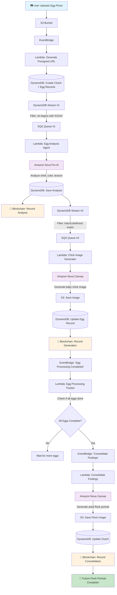

# 🐔 Don't Count Your Chickens - Judging Data Submission

**Team**: Purple Team
**Project**: AI-Powered Chicken Egg Viability Analysis with Blockchain Certification

---

## Magnificent Impracticality (Max 40 pts)

### Data Point 1: Infrastructure Scale

We deployed an enterprise-grade serverless architecture to analyze chicken eggs:

| Resource Type | Count | Purpose |
|---------------|-------|---------|
| Lambda Functions | 18 | 8 Python, 10 Node.js |
| SQS Queues | 2 | Async egg processing pipeline |
| DynamoDB Streams | 2 | Event-driven triggers with filtered patterns |
| EventBridge Rules | 2 | Event choreography |
| S3 Bucket | 1 | Image storage with EventBridge integration |
| DynamoDB Table | 1 | Single-table design with GSI |
| HTTP API Gateway | 1 | 30+ REST endpoints |

### Data Point 2: Blockchain Integration for Poultry

We integrated **Amazon Managed Blockchain Access** to record egg lifecycle events to the **Ethereum mainnet**:

- Real gas fees paid for chicken egg transactions
- SHA-512 hashes generated for egg analysis data
- Carbon footprint calculated per transaction (~0.000005g CO2)
- NFT minting for hatched chicks with rarity tiers: COMMON → UNCOMMON → RARE → EPIC → LEGENDARY

---

## Pointless Problem Solving (Max 35 pts)

### Data Point 1: 47 Required Metadata Fields Per Egg

Each egg registration validates 47 scientifically questionable fields including:

- `lunar_phase_at_collection`
- `cosmic_radiation_level`
- `gravitational_anomalies`
- `quantum_entanglement_coefficient`
- `rotational_inertia`
- `acoustic_properties`
- `magnetic_field_strength`
- `solar_activity`
- `electromagnetic_interference`
- `thermal_conductivity`

The system adjusts predicted hatch dates based on lunar cycles and solar activity levels.

### Data Point 2: The Rube Goldberg Data Pipeline

To analyze a single egg photo, data flows through:

**The problem this solves**: Farmers have been waiting 21 days to see their chickens. We reduced that to ~45 seconds of AI processing and blockchain recording.

---

## Entertainment Excellence (Max 25 pts)

### Data Point 1: AI-Generated Future Flock Portraits

When all eggs in a clutch are analyzed, the system generates a **group photo of the predicted adult chickens** - birds that don't exist yet, from eggs that haven't hatched, posing together in a family portrait they'll never actually take.

The consolidation Lambda builds a detailed prompt describing each chicken's:
- Plumage color
- Comb type
- Body type
- Feather pattern
- Leg color

Then asks Amazon Nova Canvas to render them all together as a flock.

### Data Point 2: The Absurd Details

- **Digital twin profiles** include `quantum_entanglement_coefficient: 0.42`
- **NFT rarity tiers** for baby chicks determine collectible value
- **Hatch date predictions** adjusted by lunar phase and solar activity
- **Carbon footprint tracking** for each blockchain transaction (we're sustainable about our impracticality)
- **"Maternal Simulation"** feature in the dashboard
- **Emotional support** planned for low-viability eggs

---

## One-Liner Summary

> We built an enterprise-grade, blockchain-backed, AI-powered system with 18 Lambda functions and 47 metadata fields to solve a problem that farmers have handled for 10,000 years by simply waiting 21 days.

---

## Demo Tagline

> "We automated patience. You're welcome."
